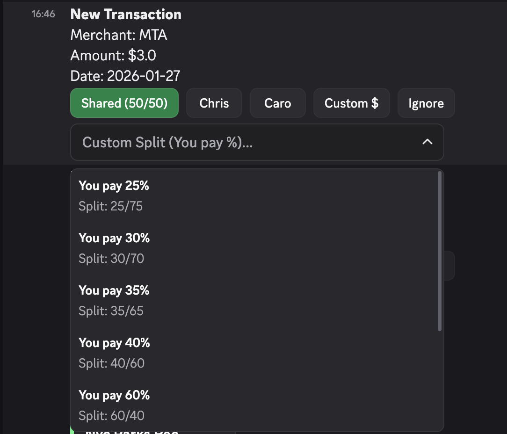

# Credit Card Tracker (cc-classifier)

A serverless Python application that automates credit card expense tracking and splitting for two users sharing a single account. Built entirely on AWS, this project integrates with the Plaid API to fetch daily transactions and leverages Discord's interactive UI components (Buttons, Dropdowns, Modals) for real-time expense classification.

## 🚀 Overview

The goal of this project was to eliminate the manual overhead of tracking shared expenses using spreadsheets. By bringing the classification process directly into a Discord channel, it allows users to assign or split transactions with a single click as soon as they clear the bank.

At the end of each billing cycle, the system automatically calculates the final settlement and generates a summary report, detailing exactly who owes what.

## 🛠️ Tech Stack & Architecture

This project is built using a modern, event-driven serverless architecture on AWS.

- **Language:** Python 3.11
- **Infrastructure as Code:** AWS SAM (Serverless Application Model)
- **Compute:** AWS Lambda (Event-driven processing and webhook handling)
- **Database:** Amazon DynamoDB (NoSQL storage with atomic updates for high concurrency)
- **API Gateway:** HTTP API for receiving and validating Discord Webhooks via Ed25519 signatures
- **Scheduling:** Amazon EventBridge (Cron jobs for daily syncing and monthly settlements)
- **External APIs:**
  - **Plaid API:** Securely authenticates and fetches bank transaction data.
  - **Discord API:** Sends rich embeds and handles interactive message components.

## ✨ Key Features

- **Automated Daily Sync:** A scheduled EventBridge rule triggers a Lambda function daily to fetch the latest cleared transactions via Plaid and persist them to DynamoDB.
- **Interactive Discord UI:** New transactions are pushed to a private Discord channel as rich embedded messages. Users can classify expenses directly within Discord using:
  - **Buttons:** Quickly assign 100% of the cost to User A or User B, or split it 50/50.
  - **Dropdown Menus:** Select custom percentage splits (e.g., 70/30) or input a specific dollar amount.
  - **Modals:** Add contextual text notes to a transaction for future reference.
    
- **Webhook State Management:** When a user interacts with a message, Discord sends a payload to the API Gateway. A dedicated Webhook Lambda verifies the request signature, atomically updates the transaction state in DynamoDB, and dynamically updates the message color (e.g., green for classified, grey for ignored) to prevent double-processing.
- **Automated Settlements:** On the 1st of every month, an automated job queries DynamoDB using a Date Index to retrieve all transactions from the previous billing cycle. It calculates the final balances and posts a settlement summary to a dedicated Discord channel.
  
- **Transaction Management:** Users can mark specific transactions (like credit card payments) as "Ignored" to exclude them from the monthly calculation, or easily undo a classification if a mistake was made.

## 🔒 Enterprise-Ready Engineering

While this began as a personal automation project, it has been rigorously engineered to production standards, demonstrating a mature Software Development Lifecycle (SDLC):

- **CI/CD Pipelines:** GitHub Actions automatically enforce code quality (linting and formatting), run the comprehensive `pytest` suite, and manage seamless deployments (`sam build` & `sam deploy`) to AWS upon merging to the `main` branch.
- **Secret Management:** Sensitive credentials (like Plaid and Discord API tokens) are securely stored and fetched dynamically using **AWS Secrets Manager**, avoiding static environment variables or `.env` files in production.
- **Environment Isolation:** AWS SAM parameters are leveraged to maintain strictly bifurcated `dev` and `prod` stacks, ensuring safe testing against isolated DynamoDB tables without impacting live settlement data.
- **Security & IAM:** Adheres to the principle of least privilege. Lambda execution roles are tightly scoped, granting access only to the specific DynamoDB tables and Secrets Manager resources required.
- **Observability:** Positioned for high reliability with planned integration of structured JSON logging for Amazon CloudWatch and automated alarms to proactively monitor function health and third-party API integrations.

## 📁 Project Structure

- `lambdas/`: AWS Lambda function handlers for cron jobs (`daily_scan.py`) and API webhook events (`webhook.py`).
- `lib/`: Core business logic including API clients (`plaid_client.py`, `discord_client.py`), database interactions (`storage.py`), and mathematical settlement logic (`settlement.py`).
- `tests/`: Comprehensive `pytest` suite with over 90% code covereage utilizing `pytest-mock` and `moto` to simulate AWS services locally without requiring live credentials.
- `template.yaml`: The AWS SAM template defining the infrastructure resources, IAM policies, and environment variables.

## 🎯 Purpose

This project is a personal automation for my partner and I to more easily track the expenses that we put on a shared credit card. Before, settling up was a messy monthly process inside of a spreadsheet with clunky formulas.

Now, we have an automated system to notify us of new transactions as they come which also settles up each statement for us, significantly reducing our manual workload!
