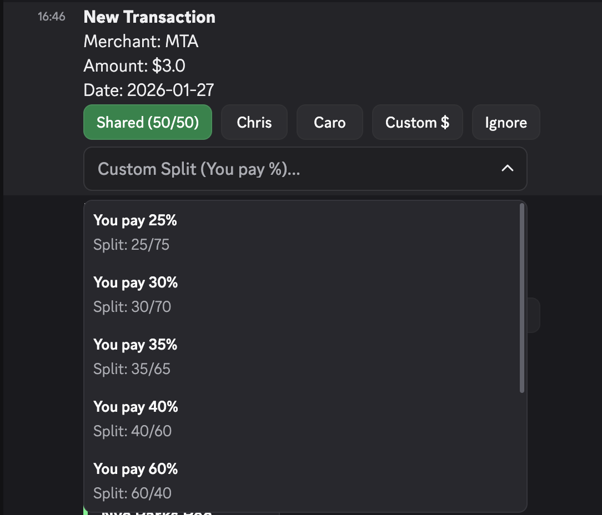

# Credit Card Tracker (`cc-classifier`)

A full-stack, serverless project I built to replace a spreadsheet-based process for splitting expenses on a shared credit card. It connects Plaid transaction data, interactive Discord messages, and a private statement review app so two people can classify purchases as they arrive and settle each billing cycle accurately.

The project demonstrates event-driven AWS architecture, third-party API integration, stateful transaction processing, authenticated web development, and deployment automation.

## Engineering highlights

- **Incremental transaction sync:** A scheduled Lambda persists Plaid's sync cursor in DynamoDB and processes added, modified, and removed transactions.
- **Interactive workflow:** Discord components and modals let users classify, split, annotate, ignore, and undo transactions. The webhook validates Discord signatures before processing interactions.
- **Concurrency controls:** Conditional DynamoDB writes prevent duplicate transaction inserts and conflicting classification or admin edits. Statement changes use version checks.
- **Reviewed settlement:** A Cognito-protected React app lets an admin confirm billing periods, correct transaction data, and publish a calculated settlement or revision to Discord.
- **Automated delivery:** GitHub Actions checks pull requests, deploys same-repository PRs to an isolated dev stack, and deploys production from `main` using AWS SAM.

## How it works

1. An EventBridge schedule runs the daily scan at 09:00 UTC in production. The Lambda uses Plaid's transaction sync cursor, stores transactions in DynamoDB, and sends new transactions to a Discord classification channel.
2. Discord buttons, menus, and modals let users assign a transaction to either person, choose a split, add a note, ignore it, or undo a classification. The webhook verifies Discord's Ed25519 signature before updating DynamoDB.
3. On the first of each month, a separate 10:00 UTC schedule posts a **review reminder**, not a settlement amount.
4. An admin signs in to the statement review app, confirms the inclusive billing dates, fixes transaction details, and publishes the calculated settlement to the Discord settlements channel. Subsequent edits can be published as a revision.



## Architecture

- **Backend:** Python 3.11 AWS Lambda functions for daily scanning, Discord interactions, and the admin API.
- **Data:** DynamoDB stores transactions, the Plaid sync cursor, and statement review metadata. AWS Secrets Manager supplies Plaid and Discord credentials.
- **APIs:** API Gateway REST endpoints receive Discord interactions and serve the admin API. Cognito authorizes the admin routes.
- **Admin site:** React, TypeScript, and Vite build a static site served through CloudFront and a private S3 bucket. CloudFront forwards `/api/*` to API Gateway.
- **Infrastructure:** AWS SAM defines the resources and the production schedules.

The review app's workflow, authentication, and deployment details are in [docs/statement-review.md](docs/statement-review.md).

## Repository layout

| Path | Purpose |
| --- | --- |
| `lambdas/daily_scan.py` | Plaid sync and monthly review reminder |
| `lambdas/webhook.py` | Discord interaction verification and handling |
| `lambdas/admin_api.py` | Statement review and publishing endpoints |
| `lib/` | Plaid and Discord clients, DynamoDB storage, statement and settlement logic |
| `web/` | React statement review app |
| `scripts/` | Local utilities and deployment helpers |
| `template.yaml` | AWS SAM infrastructure |
| `tests/` | Python tests |

## Local checks

Use Python 3.11 and Node.js 22. From the repository root:

```sh
python3.11 -m venv .venv
.venv/bin/python -m pip install -r requirements.txt ruff
.venv/bin/python -m pytest tests/
.venv/bin/ruff check .
.venv/bin/ruff format --check .
npm ci --prefix web
npm run build --prefix web
```

The frontend build checks TypeScript and bundles the app. An end-to-end sign-in check uses a deployed site because Cognito's callback URL is the CloudFront address. `scripts/run_local.py` has utilities for scanning, webhook simulation, and inspecting or changing DynamoDB data; commands that touch external services need suitable environment configuration and credentials.

## Deployment

The production GitHub Actions workflow runs Python tests, deploys the SAM stack on non-documentation pushes to `main`, updates Discord's interaction endpoint, builds the admin site, and uploads it to S3. The pull request workflow runs Ruff, Python tests, and the frontend build. Passing pull requests from this repository also deploy to a shared `credit-card-tracker-dev` preview stack; fork pull requests only run checks. The preview has its own DynamoDB table, Cognito pool, API, and site, with schedules disabled. Its URL appears in the Actions job summary.

The SAM template accepts `Environment` (`dev` or `prod`), `SecretsEnvironment`, `PlaidEnv`, Discord channel IDs, and the two users' names and Discord usernames. Deployment requires the corresponding AWS credentials and a Secrets Manager secret containing the Plaid and Discord credentials. See [statement review setup](docs/statement-review.md#build-and-deploy) for the admin account and manual dev deployment steps.

## Current scope

The app handles transaction classification and reviewed settlement publication for a shared card. It does not automatically publish calculated totals at month end; the admin confirms the statement first. Planned operational work, including structured logging and alarms, is tracked in [docs/production_roadmap.md](docs/production_roadmap.md).
